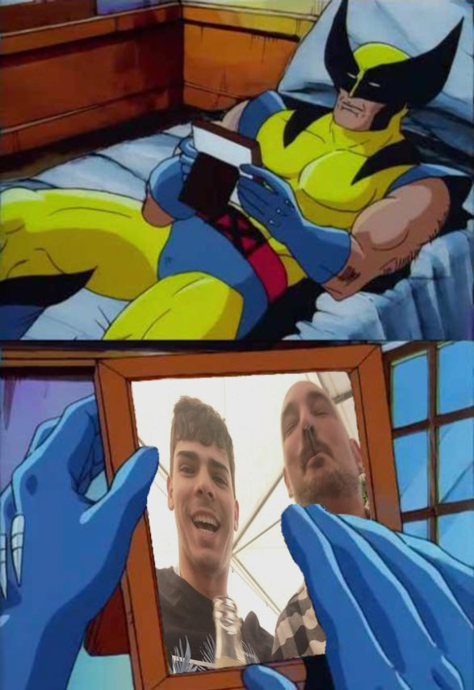

<strong>C:</strong> La máquina de la lógica. Si hay una forma óptima de hacer algo, la encontrará, la criticará y luego te dirá que eres un inútil por no haberlo visto antes.

<strong>J:</strong> Maestro de las palabras y diplomático de Cumstadística. Puede venderte cualquier idea con tal de que suene razonable, aunque sea una estafa piramidal.

<strong>U:</strong> La memoria encarnada y el más pachamamesco del grupo (aunque lo niegue). Cree que todo lo comercial es basura y que el arte de verdad es una película muda serbo-croata de 12 horas sobre la pesca artesanal.

### El Loco de Fortnite

### Sesa

### Gurb

### Calvo Cuñao

Personaje secundario. Tío de J

### Enjuto Mojamuto

