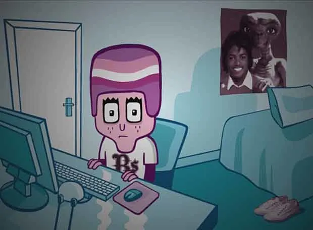

<strong>C:</strong> La máquina de la lógica. Si hay una forma óptima de hacer algo, la encontrará, la criticará y luego te dirá que eres un inútil por no haberlo visto antes.

C es el estratega, el pensador, el tipo que no solo quiere saber cómo se hacen las cosas, sino por qué. No se conforma con respuestas superficiales; si le das una fórmula, te pedirá la demostración, y si le das una teoría, te exigirá ejemplos. Es el que pone orden en la Cumstadística, el que no deja que los análisis sean mediocres y el que siempre tiene un plan. Sin embargo, su lucha contra la mediocridad lo ha llevado a enfrentamientos con Sesa, a quien considera una fuerza del caos procrastinador. Le gusta trolear, pero no por diversión barata, sino para demostrar su superioridad intelectual. Su talón de Aquiles: cuando algo no sigue la lógica esperada, le hierve la sangre. Y cuando se cabrea, la frase “Eres la mierda, Sesa” resuena en el aire.

<strong>J:</strong> Maestro de las palabras y diplomático de Cumstadística. Puede venderte cualquier idea con tal de que suene razonable, aunque sea una estafa piramidal.

J es el equilibrio perfecto entre inteligencia y carisma. Si C es la lógica pura, J es la comunicación encarnada. Sabe cómo hablar con la gente, cómo caer bien y cómo salir de cualquier situación con una mezcla de ingenio y labia. Antes era un nerd solitario, pero Belmez lo transformó en un hombre del pueblo, un tipo capaz de conectar con cualquiera. Su debilidad: el Sputnik (vodka con cerveza), las galletas Dinosaurus y su fidelidad ciega a la pizza prosciutto. En lo académico, J tiene la extraña habilidad de absorber conocimientos sin parecer que estudia, lo que le ha valido el respeto (y la envidia) de sus compañeros. También es un firme defensor del derecho a ligar en cualquier circunstancia, porque “el que perdona, murió en la cruz” y “ninguna mujer es fea por donde se mea” son principios fundamentales en su doctrina.

<strong>U:</strong> La memoria encarnada y el más pachamamesco del grupo (aunque lo niegue). Cree que todo lo comercial es basura y que el arte de verdad es una película muda serbo-croata de 12 horas sobre la pesca artesanal.

U es un alma artística atrapada en un mundo de números y estadísticas. Filósofo del Excel, poeta de la Cumstadística y lector compulsivo de literatura rusa, es el único que puede recitar párrafos enteros de Crimen y castigo en ruso sin perder el aliento. Pero no te confundas: aunque le encante la literatura y lo abstracto, también tiene una mente aguda y creativa que le permite entender conceptos complejos con facilidad. Es el que siempre tiene una reflexión inesperada, el que ve más allá de los datos y encuentra el significado oculto en todo. Se dice que nunca tuvo madera de atleta, pero lo cierto es que ha canalizado esa energía en su guitarra, donde su interpretación de El Vito ya es legendaria. Su eterna pelea con los Custateros es la capitalización de la “D” en “Dios”, pero sigue firme en su lucha. Y, por supuesto, siempre está ardido porque todo le parece demasiado comercial.

### El Loco de Fortnite
Nadie sabe de dónde vino ni por qué grita "¡FORTNITE!" en los momentos más inoportunos, pero ahí está, en las sombras, esperando su oportunidad para sembrar el caos. Hay teorías que sugieren que es un viajero del tiempo atrapado en un bucle eterno de partidas en solitario, condenado a recordar la Temporada 2 del Capítulo 1 como la mejor época de la humanidad. Otros dicen que fue un ingeniero brillante que, tras una mala decisión en la bolsa de las criptomonedas, perdió todo y se convirtió en un ser errante. Lo único seguro es que, cuando menos te lo esperas, aparece... y grita... y luego desaparece, dejando un leve eco de desesperación en el aire.

### Sesa
Sesa es un enigma en sí mismo: un nini con ambición selectiva, un estratega en el League of Legends que rara vez acierta una skillshot, y un hombre que ha hecho del "mañana lo hago" su lema de vida. Para él, la procrastinación es un arte, y el Excel solo existe para hacer que ChatGPT le haga los deberes. Su mayor hazaña hasta ahora ha sido sobrevivir a las embestidas verbales de C, quien ha intentado convertirlo en una persona funcional con más insistencia que un testigo de Jehová en tu puerta. A pesar de todo, tiene su encanto y siempre está dispuesto a salir de fiesta, aunque eso implique endeudarse con tragos que alguien más acaba pagando.

### Gurb
Nadie sabe realmente quién es Gurb ni por qué está aquí. Se dice que una vez intentó integrarse en la sociedad humana, pero al descubrir la existencia del Excel y las horas de oficina, decidió mantenerse en un plano de existencia intermedio. Gurb es un ser místico, una entidad errante que observa los errores de los demás con una mezcla de compasión y burla silenciosa. Solo aparece cuando la trama lo requiere, como un Deus Ex Machina que soluciona problemas sin que nadie entienda cómo. Es el verdadero espíritu de la Cumstadística: una presencia inefable que deja más preguntas que respuestas.

### Calvo Cuñao

Personaje secundario. Tío de J

### Enjuto Mojamuto

